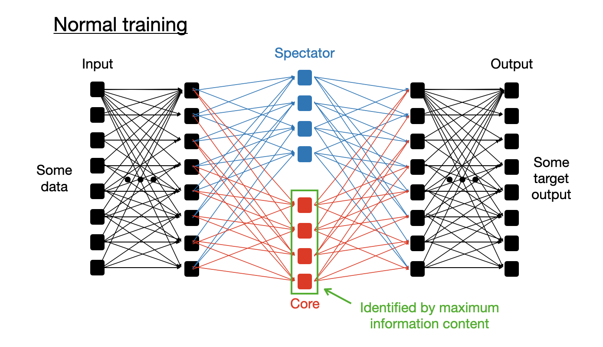
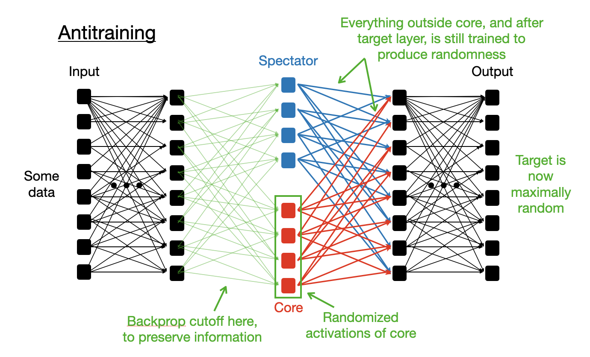
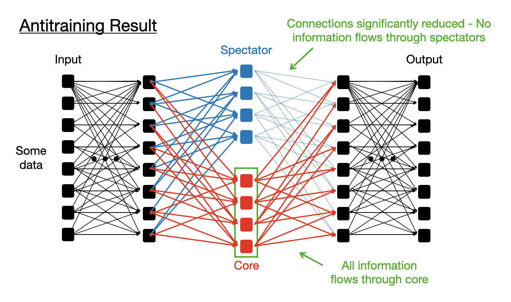
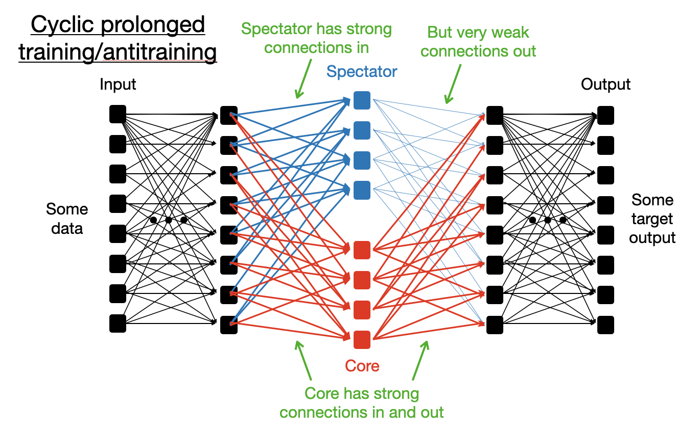
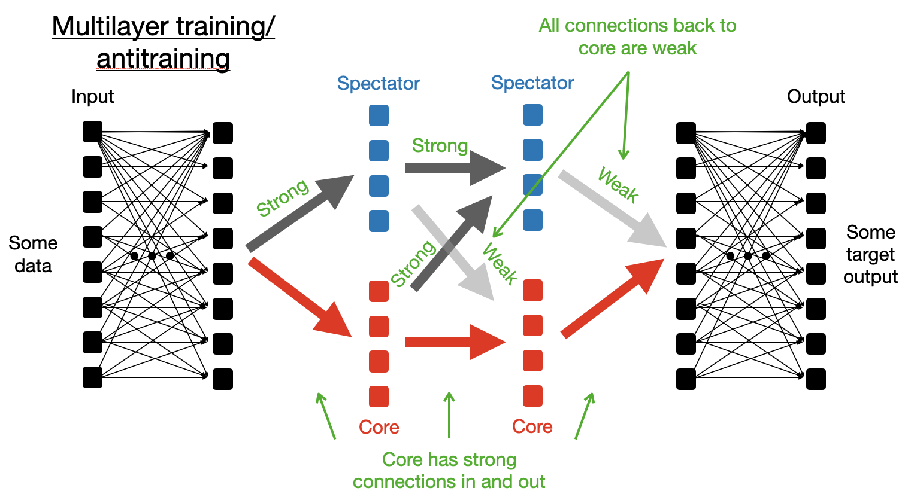

# Thoughts on building interpretable Neural Networks

Disclaimer: these ideas haven't been tested in experiments yet (nor have I thoroughly searched the literature).
This is on my to do list, but sometimes it's useful to brainstorm without constraints for maximum creativity before testing. 

## Motivation
This is a list of motivating questions to consider, before I propose some solutions.
1. Is it possible to force information to flow through a specific neuron in a network, or a subset of neurons, and  not around it?
	
    * This is a simple building block for interpretability if we force a specific concept to be hosted in a specific spot. 

2. Is it possible to design a regularization method which adapts optimally to the structure of the information being learned, rather than requiring tuning hyperparameters (like the L2 regularization or dropout coefficient)? 
	
    * Colloquially, we would like to regularize the network based on what it does (referenced to the problem in question, and therefore not a choice dependent on the network architecture, size, learning rate, etc.), not on what it is (conventional regularization depends on the learning rate, network size, etc). 

3. Can we design a learning method that is sensitive to the non-linear structure of the network (rather than only depending on infinitesimal gradients)?
	
    * If this is sufficiently different from normal regularization methods (ie it contains new information), perhaps it enables drastically increased learning rates, or obviates the need for tuning hyperparameters, etc?)

4. Is the non-local distribution of information in a neural network (that is, distributing identical information over multiple neurons instead of packing it into one neuron) a useful feature or a bug?
        
    * If information flows identically through two neurons with half amplitude to the next layer, is it better to send it through 1 neuron at full amplitude instead? 
      * My intuition is this is better. One neuron has improved interpretability, certainly. It may also have improved learning rate above noise levels (since neurons are subject to noise at some level, and we want to beat that at least?)
    * Regularization methods like dropout and L2 norm explicitly encourage this sort of redundancy (L1 doesn’t though) 

5. Is it possible to compress the information flow in a neural network to a certain structure: A representative network which is representative of an equivalence class of neural networks that solve the same problem? 

   * This method may not be computationally efficient, but if you could show that it always resulted in roughly equivalent networks, then you would only have to do the training one time. 

   * This is a serious step at making information flow interpretable.  
            
     * At some level, you could make each neuron correspond to a single concept or subset of concepts if desired.
              
     * This is vaguely similar to beta-VAE favoring independent axes 
      
   * Ideally, this could result in compressed information flow (making the network effectively as small as possible at each layer).
   
   * This could potentially produce exchangeable building blocks targeted to specific problems, that could be dropped into different locations in a larger network as necessary.

## Proposed method: Antitraining and spectator networks

How to force information to flow through a subset of target neurons in a layer of a neural network?
(This is in contrast to using the entire layer, which contains the target neurons and other neurons, 
here referred to as spectator neurons.)
* Solution: Use the converse logical statement of the training goal as the training target (hence the terminology "anti"-training)
  > Conventional training: 
  > learn to predict statement X (like classify an image of a cat) using the full
 set of neurons in a layer of a MLP. Use both the target neurons and spectators. 
  This results in information flowing everywhere in the layer. 
 

  > Antitraining: train to NOT predict statement X (and instead be maximally random) when the target neurons are randomized. 
    Simultaneously intersperse this antitraining with regular training. 
    
     
  
### Basic steps of antitraining
Note: These steps are formulate for conceptual clarity, not computational efficiency (some efficiency ideas are explored below).
1. Train normally for some period of time.
   1. Keep a running average of the mean and standard deviation of each neuron firing amplitude.
   2. When we say we "randomize a neuron" below, we will sample its value randomly from within such a distribution, tailored for each neuron.
2. Measure the information content of each neuron in the layer.
   1. Randomize a specific neuron (within its full normal range of activations, which is a highly nonlinear change) 
   and see how much worse the prediction accuracy becomes. 
   2. Rank the neurons by their information content (highest disruption = highest information content).
3. Identify a core set of neurons that contain "most" of the information content of the layer, say 95%.
   1. To do this, find the smallest subset of the most high information content neurons which, when randomized,
   are sufficient to reduce the prediction accuracy by 95% of its way from best to worst prediction.
      * Best loss is loss without any randomization
      * Worst loss is with total randomization of the layer. 
      * To get the subset, take the most high information content neuron, then the 2 highest, and so on, until it's large enough.
      (For efficiency, probably you would actually do a binary search on the set size, since it's already ordered).
   2. Call the highest information subset the "core" neurons, and the rest the "spectator" neurons.
      * It may be the case that the core set is only a small fraction of the total neurons, or it may be most of them.
      This is determined by the information content of the network and the problem at hand.
5. Antitrain the spectator neurons in order to erase the information contained in those neurons, 
after which all information flows only through the core neurons 
   1. Specifically, for each step of antitraining:
      1. Randomize all core neurons in the target layer (gradients do not flow backward through that layer now).
      2. Input a normal example to the network and do forward propagation.
      3. Set the target to NOT be the normal target, but instead a random sample of the training dataset 
         * This could either be a specific classification object for a categorical output, 
         * or it could be uniform (or representative) distribution over the categorical outputs (this is probably better).
      4. Do back propagation on the portion of the network that comes AFTER the spectator neurons only.
      5. If any information flowed through the spectator neurons, it will cause the original target to be 
      favored compared to the more random distribution. This will be high loss. 
      Normal training to reduce loss will therefore push that information to be erased, specifically by
      detaching the output of the spectator neurons from the later layers of the network 
      (though the input will be unchanged). 
        * (non-random prediction with random prediction target = high loss).
   2. It may be necessary to renormalize the spectator neurons in some way to prevent them blowing up during antitraining.
        * I think it's likely this isn't necessary, though, because the training to produce random output should at most cause 
      the weights and biases to diffuse (goes like square root of time) once the relevant information has been erased, 
      which happens much slower than some gradient descent (linear in time steps).

Repeating these steps multiple times should compress the set of core neurons further, until they are as small as possible
given the problem at hand. 

#### How does this process result in regularization? 
The fact that the threshold of "95%" or something similar is used for the information content cutoff of the core neurons, 
will result in effectively some regularization of the network's prediction confidence. 
Probably/perhaps this is sufficient to replace other forms of regularization, and won't need to be tuned much 
(can be decayed to 100% maybe). 

#### The resulting network represents the minimally compressed equivalence class of networks solving the same problem

The ultimate compression level of the core neurons (the core neuron number) 
should be a property of the information 
trying to be predicted from the samples, not something to do with the architecture itself. 
If we start from a fully-connected MLP (with sufficiently many neurons in each layer), 
I think this should indeed converge to an identical representative structure.  

### Basic extension: Cyclic batch training
Do a long period of training then a long period of antitraining, then repeat. 
This long period of normal training will store information in the spectator network.
Then antitraining will detach that information from future layers. 
In this way, we get to test various more global initializations of network structure, 
and find the global optimum.

More specifically, with long cycles, 
* After antitraining, this should create a spectator network at each layer that contains the information of the 
previous layer, but is detached from future core layers.
* The subsequent training cycle should reattach stored information in the spectator network back to future core neurons.

* This should be injecting somewhat fully-formed concepts in a somewhat random way 
into the information content of the later parts of the network. 
One might hope that this lets you explore many different strategies for information flow quickly, 
and to keep certain previously learned or slightly sub-optimal strategies in reserve.
  
This seems similar to cycling the learning rate with snapshot ensembling, but in this case you're snapshot ensembling
only the components of the network and recycling them (not combining totally different full-network snapshots).
You are only keeping the best components (most dense) at any point in time.

> Cyclic training: The spectator neurons learn to encode complex information, but don't pass it on to the next layer. 
    

#### Multilayer antitraining
This antitraining process can be done for each layer of the network to compress it as much as possible. 

Here each spectator group in each layer can carry useful information.
It can even carry information to the next spectator group (as long as that spectator group is eventually detached).
The result is that stored information and circuits can be archived for later use, and propagate through the spectator network.

> Multilayer training: This results in storing and passing information between spectator networks, as long as
it is never passed back to the core. 
    

## Future ideas

### 1. Measure and identify neurons that generalize rather than memorize, and encourage these
Perhaps to encourage learning circuits that generalize rather than memorize information, we can
test for neurons that best improve test loss rather than training loss.
* Specifically, when measuring information content of neurons, we can use held out training data.
* In this way, we can identify neurons that learn more general circuits
  (as shown in this paper: https://arxiv.org/abs/2301.05217).

If we explicitly erase non-generalizing circuits, and only leave generalizing circuits, this may be a way to
drive behavior like grokking early in training, and overall might drive significantly improved training efficiency.

### 2. Explore adapting the training method based on information content (similar to Adam)
Instead of scaling the update rate to each parameter based on the past gradients observed (as in Adam optimization),
perhaps it would be useful to keep track of the information content of each neuron, and adjust the update strength
(not sure up or down) based on the approximate information content.
* One could imagine that we should train high information content neurons faster than low information ones?
  Perhaps simply because we can do this with high signal to noise?
  (in fact, by force information to go through fewer neurons, the SNR of each neuron should increase, so that
  maybe just doing regular Adam optimization would already accomplish this effective learning rate increase.)

### 3. Improve efficiency of measuring information
Measure information content in batches: Probably it's sufficient to measure the information content of neurons in batches.
Can probably randomize a few percent of each layer at a time to test,
and set the effective importance of each neuron to be updated by 1/(the number of neurons) randomized. 

### 4. Meta learning of the network structure
Are there rules that can be used to adjust the network structure to find optimality?
* Ie a continuously tunable activation function, with a parameter that controls the shape, 
interpolating between sigmoid and ReLU and beyond.
* The ability to learn to tie parameters together and end up creating a convolutional network 
  * If two neurons being randomized together is more problematic than randomizing them independently, 
  then this might indicate they should be tied together (if they carry the same information then separate randomization would lead to diffusion of the output which is less problematic than correlated randomization).
* The ability to drop in test sections like transformers 
* Can we train a network for meta-learning, or a second network that learns how to learn, 
or learns how to tune the structure of the network over time based on behavior. 

### 5. Exploring mutual information between neurons
Does randomizing 2 neurons together lead to the same loss increase as randomizing each alone? 
If so, then they carry mutual information somehow. Is this a good thing? Should it be encouraged?

If randomizing any 1/N neurons is enough to destroy all information, and randomizing all N/N neurons doesn't 
make it further worse, then those neurons are entangled in someway. It's probably the most dense representation possible? Not sure.

### 6. Compressing transformers 
One could use this concept of antitraining to compress the dimensionality of the embedding in GPT-3, for example (by 
treating each embedding dimension as a neuron that can be core or spectator), or to 
learn if the number of heads, or layers, could be reduced (by simultaneously treating each head as a single abstract "neuron"
to be randomized or not), or if the size of each MLP layer in the transformer
could be adjusted down (or up). 

This could improve speed and computational efficiency of transformers. 

### 7. Concept-level learning by antitraining with concept-level training targets. 
Imagine if a minimal network could be trained to predict specific high-level concepts about a problem.
For image identification, it could decide between animals and non-animals.
For text, it could decide between nouns and verbs, or between abstract and concrete concepts.
(gathering such training data seems relatively easy)

Such a minimal model could be created with antitraining, by just using these classifiers as training targets. 
Such a model could then be "hooked in" to a more complicated model, and provide interpretability as well as potentially 
reduced complexity required in the remainder of the network. 

Alternatively, one could take a larger network (like the full GPT-3 architecture), and just force
specific parts of it to encode specific sets of information by antitraining on those high level classes 
at interspersed intervals. (Admittedly, this seems a bit harder to control and define in a generalizable way, but maybe).

## Related concepts
I haven't yet done a systematic literature search, but below are a collection of papers to be aware of.

Similar concepts:
* Ablations to discover causal structure of network (used in many papers).
* ROME (Rank one model editing) concept of restoring information to see when success reappears
  (see paper: https://arxiv.org/pdf/2202.05262.pdf)

General interpretability and visualization:
* OpenAI clip and microscope
  * 	Microscope: https://openai.com/blog/microscope/ 
  * 	Clip: https://openai.com/blog/clip/
* Circuits 
  * 	https://distill.pub/2020/circuits/zoom-in/
* Feature visualization 
  * 	https://distill.pub/2017/feature-visualization/
* Toy models of superposition  
  * 	https://transformer-circuits.pub/2022/toy_model/index.html#motivation
* Mathematical framework for transformer circuits
  * 	https://transformer-circuits.pub/2021/framework/index.html 
* In context learning and induction heads
  * 	https://transformer-circuits.pub/2022/in-context-learning-and-induction-heads/index.html 
* Mechanistic interpretability of grokking
  * https://arxiv.org/pdf/2301.05217.pdf

Other potentially relevant papers:
* Merging models via permutation symmetries (Git re-basin)
  * 	https://arxiv.org/pdf/2209.04836.pdf
* Adaptive dropout paper
  * 	https://proceedings.neurips.cc/paper/2013/file/7b5b23f4aadf9513306bcd59afb6e4c9-Paper.pdf
* Estimating Information Flow in Deep Neural Networks - paper title 
  * 	https://arxiv.org/pdf/1810.05728.pdf
* Opening the Black Box of Deep Neural Networks via Information
  * 	https://arxiv.org/abs/1703.00810
* Neural networks efficiently learn low-dimensional representations with SGD
  * 	https://arxiv.org/pdf/2209.14863.pdf
* Infogans
  * https://arxiv.org/pdf/1606.03657.pdf